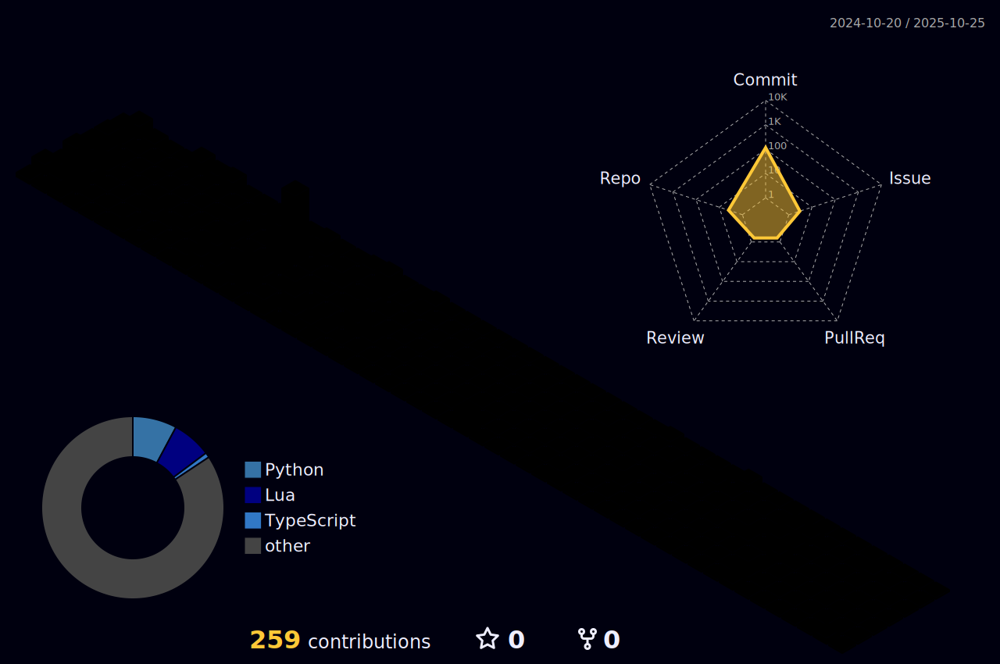

<div align="center">

</div>

<!-- <h1 align="center">Hi 👋, My name is SouLLesSNesSZeN</h1>

<h3 align="center" font-size="24px">Financials Data Analyst and Full Stack Developer</h3> -->

<div align="center">

[](https://git.io/typing-svg)

</div>

I'm working as a freelance Full-Stack Developer and Financial Data analyst.

- 🌍  I'm based in Thailand
- 🧠  I'm learning NextJS, Redux, Supabase, firebase and Chakra-UI
- ⚡  In my free time I read tech articles and practice new framework and new language.

<h3 align="left"> 📫 Connect with me:</h3>
<div>
    
[](mailto:soullessness1611@gmail.com)&nbsp;
[](https://www.facebook.com/Patisamphitha)

<!-- [](https://www.instagram.com/insightsoulless) -->
  
</div>

<picture>
  <source media="(prefers-color-scheme: dark)" srcset="https://github.com/soullessness1611/soullessness1611/raw/refs/heads/output/github-snake-dark.svg">
  <source media="(prefers-color-scheme: light)" srcset="https://github.com/soullessness1611/soullessness1611/raw/refs/heads/output/github-snake.svg">
  
</picture>

<br>
<h2> 🧑🏻‍💻 My Tech Stack</h2>

### 🧠 Data Science / Machine Learning / Deep Learning

<div style="margin-top: -40px;">

<!--  -->


</div>

### 🌐 Web Development

- <h5>🎨 Frontend </h5>
  <p>
     <a href="https://skillicons.dev">
       
     </a>
  </p>

- <h5>🤖 Backend </h5>
  <p>
      <a href="https://skillicons.dev">
        
      </a>
  </p>

- <h5>🛢️ Database </h5>
  <p>
      <a href="https://skillicons.dev">
        
      </a>
  </p>

### 💻 Software and Tools

<p>
    <a href="https://skillicons.dev">
      
    </a>
</p>

### 💻 Operating Systems

<p>
    <a href="https://skillicons.dev">
      
    </a>
</p>

<br>
<h2 align="center">📊 Github + WakaTime Stats</h2>
<div align = "center">


<a href="https://github.com/soullessness1611/github-readme-stats">
    
</a>
<a href="https://github.com/cicirello/user-statistician">
    
<!-- [](https://github.com/cicirello/user-statistician) -->
</a>

</div>

<!--START_SECTION:waka-->
📊 **This Week I Spent My Time On** 

```text
💬 Programming Languages: 
Python                   9 hrs 11 mins       ████████████████████████░   96.97 % 
Prisma                   9 mins              ░░░░░░░░░░░░░░░░░░░░░░░░░   01.68 % 
INI                      3 mins              ░░░░░░░░░░░░░░░░░░░░░░░░░   00.66 % 
Other                    2 mins              ░░░░░░░░░░░░░░░░░░░░░░░░░   00.36 % 
Bash                     1 min               ░░░░░░░░░░░░░░░░░░░░░░░░░   00.30 % 

🔥 Editors: 
Neovim                   9 hrs 28 mins       █████████████████████████   100.00 % 

💻 Operating System: 
WSL                      9 hrs 28 mins       █████████████████████████   100.00 % 
```


<!--END_SECTION:waka-->

<h2 align="center">👨‍💻 More About Me on GitHub</h2>

<div align="center">

<!--  -->
<a href="https://stats.hyo.dev/en">
    
</a>
<!-- [](https://git.io/streak-stats) -->
<a href="https://git.io/streak-stats">
    
</a>

</div>

<div align="center">

<a href="#">

</a>
<a href="#">

</a>

<a href="https://github.com/Ilvondir">
    
</a>


<!--  -->
<!--  -->

<!--  -->


[](https://github.com/soullessness1611/github-readme-activity-graph)

<!--  -->
<!---->
<!--  -->
<!---->

</div>

<!--
<h2 align="center">👨‍💻⌚ WakaTime Tracking</h2>
<div align="center">
    <details>
        <summary>⏳ Year Progress</summary>
        
    </details>
    <details>
        <summary>📊 Month Progress</summary>
        
    </details>
    <details>
        <summary>⌚ Week Progress</summary>
        
    </details>
    <details>
        <summary>🕹️ Coding Activity</summary>
        
    </details>
    <details>
        <summary>📝 Editors</summary>
        
    </details>
</div>
-->

<!-- </embed></figure> -->
<!-- </embed></figure> -->
<!-- </embed></figure> -->
<!-- </embed></figure> -->

<h2 align="center">📉📈 Github Metrics Stats</h2>


